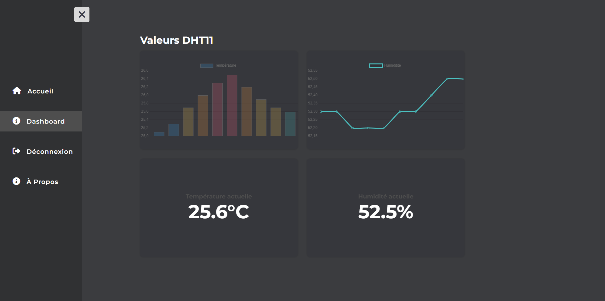

# Projet IoT - Supervision d’une salle de serveurs

Ce projet a été réalisé dans le cadre de notre formation en BTS CIEL IR au lycée César Baggio. Il s'agit d'un système de surveillance environnementale pour une salle de serveurs, conçu pour répondre aux besoins de l'entreprise Nomios, dans le cadre d'une mise en situation.

---

### Aperçu

---

### Description du contexte

Nomios est une entreprise informatique qui accompagne les clients dans l’étude, le choix et l’installation de solutions de sécurité. L’entreprise dispose d’une salle de serveurs qui abrite des équipements valorisés à plusieurs milliers d’euros. Maintenir l’équipement informatique à des températures et un taux d’humidité constants est un élément essentiel. Une température trop élevée engendre des pannes et une diminution de la durée de vie du matériel. Une humidité trop élevée engendre de la condensation.

---

### Expression du besoin client

Pour éviter les pannes et la condensation, il est important de pouvoir mesurer, stocker et visualiser les métriques environnementales de la salle de serveurs. De plus, l’administrateur doit être alerté en cas de température trop élevée.

---

### Participants

- [BOUTABA Ianice](https://github.com/i4n1ce)
- [KONIECZKOWICZ Raphaël](https://github.com/fyles-git)
- [WAUQUIER Alex](https://github.com/alleyne234)
